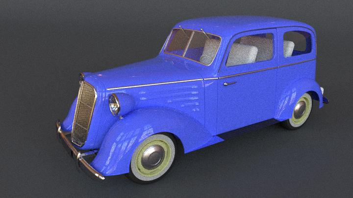
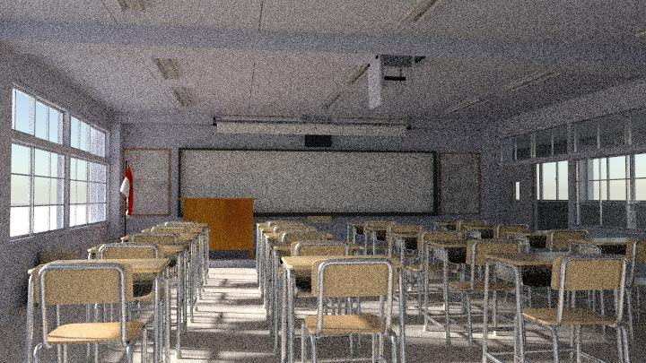
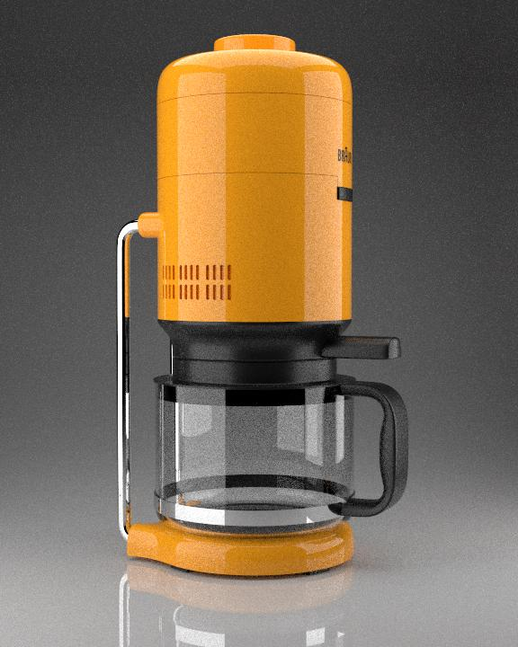
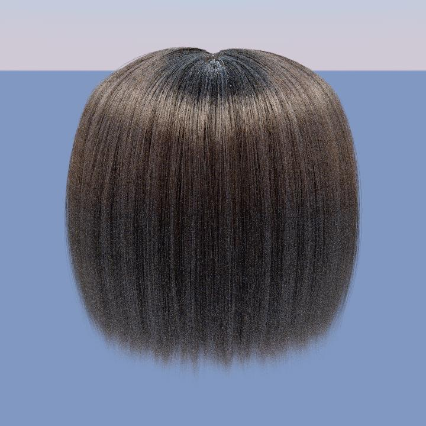
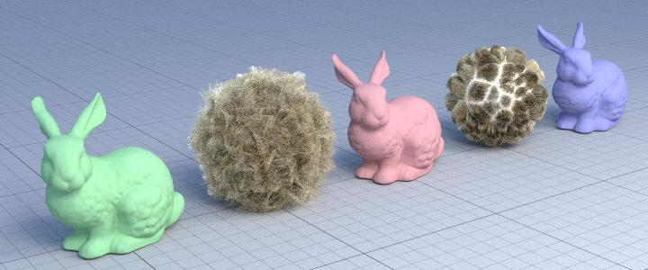

# Yocto/Pathtrace: Tiny Path Tracer

For this homework the objectives were to:

- write **camera with depth of field**
- write a **naive path tracer**
- write a **path tracer with MIS** (multiple importance sampling)
- write an **hair material** based on [pbrt v.3](https://www.pbrt.org/hair.pdf)

(The original readme of the homework can be found as `readme.html`)

## Framework

The code uses the library [Yocto/GL](https://github.com/xelatihy/yocto-gl),
that is included in this project in the directory `yocto`.

In order to compile the code, you have to install
[Xcode](https://apps.apple.com/it/app/xcode/id497799835?mt=12)
on OsX, [Visual Studio 2019](https://visualstudio.microsoft.com/it/vs/) on Windows,
or a modern version of gcc or clang on Linux,
together with the tools [cmake](www.cmake.org) and [ninja](https://ninja-build.org).
The script `scripts/build.sh` will perform a simple build on OsX.

Main functionalities can be found in `yocto_pathtrace.{cpp|h}`

This repository also contains tests that are executed from the command line
as shown in `run.sh`. The rendered images are saved in the `out/` directory.
The results can be compared with the ones in the directory `check/`.

## Functionality

In this homework/project the following features are implemented:

- **Camera Sampling** in functions `pathtrace_samples()`
- **Naive Path tracing** in function `shade_naive()`
- **Brdf sampling** in function `eval_brdfcos()`, `sample_brdscos()`
  and `sample_brdfcos_pdf()`
- **Delta handling** in function `eval_delta()`, `sample_delta()` and
    `sample_delta_pdf()`
- **Light sampling** in function `sample_lights()` and `sample_lights_pdf()`
- **Path tracing** in function `shade_pathtrace()`
- **Hair BSDF** in function `eval_hairbsdf()`, `sample_hair()` and `sample_hair_pdf()`

Extra information about Hair BSDF implementation can be found in `report.pdf`
## Some renders

### MIS Path tracer

Other renders can be found in `out/` folder

### Hair

